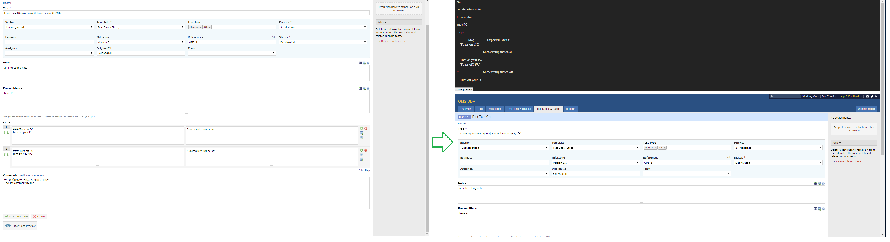

# TestRail LivePreview
This add-on injects JavaScript into TestRail web pages for Live preview of Test Case. 

Compatible with TestRail *5.5.0.3735* and lower.

After add-on:

## Release Notes
### v2.2
* fixed bug: Does not work in FF 59.0.2+

### v2.1
* fixed bug: Does not work in FF 59.0.2+

### v2.0
* removed pop-up
* added dark theme
* fixed bug: Does not work in FF 59.0.2+

### v1.3
* added empty line between Notes/Preconditions/Steps
* fixed bug: Preview shown also in administration
* changed permissions

### v1.2
* minor bug fix

## Add-on for FireFox
[TestRail LivePreview v2.2](https://addons.mozilla.org/cs/firefox/addon/testrail-livepreview/)

## Add-on for Chrome
* download file [TestRail LivePreview v2.2](https://github.com/cernyjan/TestRail-LivePreview/blob/master/testrail_livepreview-2.2-an+fx.xpi)
* extract it on the file system
* open Extensions page in browser
* click the “Developer mode” checkbox to activate it
* click the “Load unpacked extension” button
* Navigate to the extension’s directory and open it
